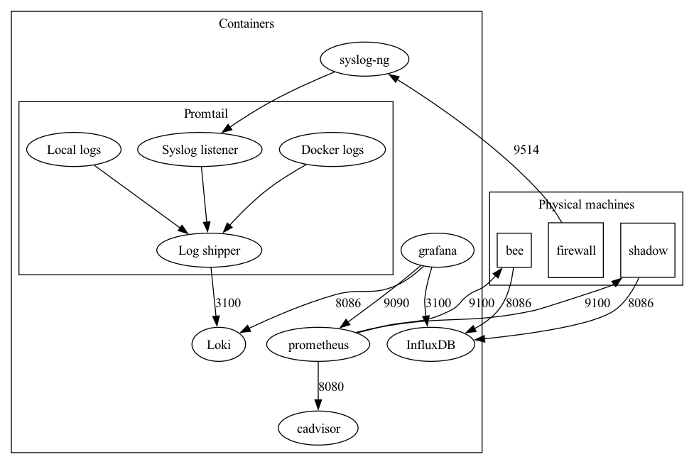

## Local requirements

### Install Ansible

```bash
sudo apt install python3-pip
echo 'PATH=$PATH:$HOME/.local/bin' >> ~/.bashrc
source ~/.bashrc
python3 -m pip install ansible ansible-lint yamllint
```

### Install terraform

https://developer.hashicorp.com/terraform/cli/install/apt#repository-configuration

### Other requirements

- default vault name: infra
- pve vault item: proxmox-login
- proxmox version 7.2-3
- use wsl

## Bootstrap PVE server

```
 cd bootstrap
 ./run.sh hostname
```

## Create servers on PVE

```
./tfrun.sh init
./tfrun.sh apply
```

## Log and metric collection communication


